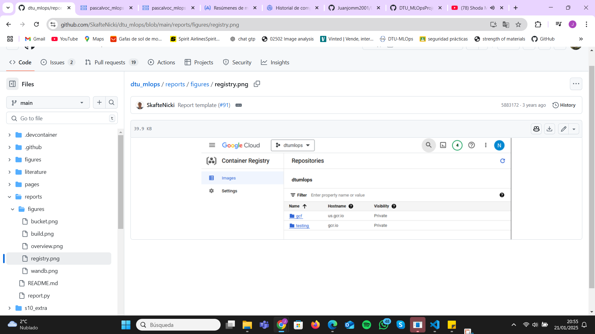

# Exam template for 02476 Machine Learning Operations

This is the report template for the exam. Please only remove the text formatted as with three dashes in front and behind
like:

```--- question 1 fill here ---```

Where you instead should add your answers. Any other changes may have unwanted consequences when your report is
auto-generated at the end of the course. For questions where you are asked to include images, start by adding the image
to the `figures` subfolder (please only use `.png`, `.jpg` or `.jpeg`) and then add the following code in your answer:

```markdown

```

In addition to this markdown file, we also provide the `report.py` script that provides two utility functions:

Running:

```bash
python report.py html
```

Will generate a `.html` page of your report. After the deadline for answering this template, we will auto-scrape
everything in this `reports` folder and then use this utility to generate a `.html` page that will be your serve
as your final hand-in.

Running

```bash
python report.py check
```

Will check your answers in this template against the constraints listed for each question e.g. is your answer too
short, too long, or have you included an image when asked. For both functions to work you mustn't rename anything.
The script has two dependencies that can be installed with

```bash
pip install typer markdown
```

## Overall project checklist

The checklist is *exhaustive* which means that it includes everything that you could do on the project included in the
curriculum in this course. Therefore, we do not expect at all that you have checked all boxes at the end of the project.
The parenthesis at the end indicates what module the bullet point is related to. Please be honest in your answers, we
will check the repositories and the code to verify your answers.

### Week 1

* [X] Create a git repository (M5)
* [X] Make sure that all team members have write access to the GitHub repository (M5)
* [X] Create a dedicated environment for you project to keep track of your packages (M2)
* [X] Create the initial file structure using cookiecutter with an appropriate template (M6)
* [X] Fill out the `data.py` file such that it downloads whatever data you need and preprocesses it (if necessary) (M6)
* [X] Add a model to `model.py` and a training procedure to `train.py` and get that running (M6)
* [X] Remember to fill out the `requirements.txt` and `requirements_dev.txt` file with whatever dependencies that you
    are using (M2+M6)
* [X] Remember to comply with good coding practices (`pep8`) while doing the project (M7)
* [X] Do a bit of code typing and remember to document essential parts of your code (M7)
* [X] Setup version control for your data or part of your data (M8)
* [ ] Add command line interfaces and project commands to your code where it makes sense (M9)
* [X] Construct one or multiple docker files for your code (M10)
* [ ] Build the docker files locally and make sure they work as intended (M10)
* [X] Write one or multiple configurations files for your experiments (M11)
* [X] Used Hydra to load the configurations and manage your hyperparameters (M11)
* [X] Use profiling to optimize your code (M12)
* [X] Use logging to log important events in your code (M14)
* [X] Use Weights & Biases to log training progress and other important metrics/artifacts in your code (M14)
* [ ] Consider running a hyperparameter optimization sweep (M14)
* [ ] Use PyTorch-lightning (if applicable) to reduce the amount of boilerplate in your code (M15)

### Week 2

* [X] Write unit tests related to the data part of your code (M16)
* [X] Write unit tests related to model construction and or model training (M16)
* [X] Calculate the code coverage (M16)
* [ ] Get some continuous integration running on the GitHub repository (M17)
* [ ] Add caching and multi-os/python/pytorch testing to your continuous integration (M17)
* [X] Add a linting step to your continuous integration (M17)
* [ ] Add pre-commit hooks to your version control setup (M18)
* [X] Add a continues workflow that triggers when data changes (M19)
* [ ] Add a continues workflow that triggers when changes to the model registry is made (M19)
* [X] Create a data storage in GCP Bucket for your data and link this with your data version control setup (M21)
* [X] Create a trigger workflow for automatically building your docker images (M21)
* [ ] Get your model training in GCP using either the Engine or Vertex AI (M21)
* [X] Create a FastAPI application that can do inference using your model (M22)
* [ ] Deploy your model in GCP using either Functions or Run as the backend (M23)
* [X] Write API tests for your application and setup continues integration for these (M24)
* [X] Load test your application (M24)
* [ ] Create a more specialized ML-deployment API using either ONNX or BentoML, or both (M25)
* [ ] Create a frontend for your API (M26)

### Week 3

* [ ] Check how robust your model is towards data drifting (M27)
* [ ] Deploy to the cloud a drift detection API (M27)
* [X] Instrument your API with a couple of system metrics (M28)
* [ ] Setup cloud monitoring of your instrumented application (M28)
* [ ] Create one or more alert systems in GCP to alert you if your app is not behaving correctly (M28)
* [ ] If applicable, optimize the performance of your data loading using distributed data loading (M29)
* [ ] If applicable, optimize the performance of your training pipeline by using distributed training (M30)
* [ ] Play around with quantization, compilation and pruning for you trained models to increase inference speed (M31)

### Extra

* [ ] Write some documentation for your application (M32)
* [ ] Publish the documentation to GitHub Pages (M32)
* [ ] Revisit your initial project description. Did the project turn out as you wanted?
* [ ] Create an architectural diagram over your MLOps pipeline
* [ ] Make sure all group members have an understanding about all parts of the project
* [X] Uploaded all your code to GitHub

## Group information

### Question 1
> **Enter the group number you signed up on <learn.inside.dtu.dk>**
>
> Answer:

48

### Question 2
> **Enter the study number for each member in the group**
>
> Example:
>

s233142, s232507, s232509 ,s233514, s240451
>
> Answer:

--- question 2 fill here ---

### Question 3
> **A requirement to the project is that you include a third-party package not covered in the course. What framework**
> **did you choose to work with and did it help you complete the project?**
>
> Recommended answer length: 100-200 words.
>
> Example:
> *We used the third-party framework ... in our project. We used functionality ... and functionality ... from the*
> *package to do ... and ... in our project*.
>
> Answer:

We used the third-party framework YOLOv8 by Ultralytics in our project, which was not covered in the course. YOLOv8 offers state-of-the-art tools for object detection, making it a highly versatile choice for building a robust and efficient pipeline. We leveraged its pre-trained models and capabilities for fine-tuning on custom datasets, which streamlined the process of training and evaluation.

Specifically, we used it on the PASCAL VOC dataset. YOLOv8's streamlined inference tools enabled us to quickly test the model's performance on new images and validate its predictions effectively.

The framework's built-in features for visualizing predictions and evaluating performance metrics further simplified the process of debugging and optimization. Its flexibility allowed us to experiment with different configurations, making it an essential component of our machine learning pipeline. By using YOLOv8, we were able to focus more on fine-tuning and evaluation, ensuring the final model met our performance expectations.

## Coding environment

> In the following section we are interested in learning more about you local development environment. This includes
> how you managed dependencies, the structure of your code and how you managed code quality.

### Question 4

> **Explain how you managed dependencies in your project? Explain the process a new team member would have to go**
> **through to get an exact copy of your environment.**
>
> Recommended answer length: 100-200 words
>
> Example:
> *We used ... for managing our dependencies. The list of dependencies was auto-generated using ... . To get a*
> *complete copy of our development environment, one would have to run the following commands*
>
> Answer:
We used `pip` to manage dependencies in our project, ensuring that all required packages and their specific versions were recorded for reproducibility. The dependency list was maintained in two files: `requirements.txt` for production dependencies and `requirements_dev.txt` for development tools. These files were created by running the command `pip freeze > requirements.txt` after installing all necessary packages.

To replicate the environment, a new team member would need to follow these steps:

1. Clone the repository to their local machine:  
   ```bash
   git clone https://github.com/moorekevin/dtu-02476-mlops-project
   cd dtu-02476-mlops-project
    ```
2. Create a virtual environment:
    ```bash
    python -m venv env
    ```
3. Activate the virtual environment:

On Windows:

    ```bash
    env\Scripts\activate
    ```
    
On macOS/Linux:

    ```bash
    source env/bin/activate
    ```
4. Install dependencies from the requirements file:

    ```bash
    pip install -r requirements.txt
    ```
5. (Optional) Install development dependencies:

    ```bash
    pip install -r requirements_dev.txt
    ```
By following these steps, the team member will have an exact copy of the environment, ensuring consistency across development and production.

### Question 5

> **We expect that you initialized your project using the cookiecutter template. Explain the overall structure of your**
> **code. What did you fill out? Did you deviate from the template in some way?**
>
> Recommended answer length: 100-200 words
>
> Example:
> *From the cookiecutter template we have filled out the ... , ... and ... folder. We have removed the ... folder*
> *because we did not use any ... in our project. We have added an ... folder that contains ... for running our*
> *experiments.*
>
> Answer:
From the cookiecutter template, we have filled out the `src/` folder to include the main modules of our project, such as `api.py`, `train.py`, `evaluate.py`, and others. The `tests/` folder was populated with test scripts for data validation (`test_data.py`), model evaluation (`test_model.py`), and API functionality (`test_api.py`). We also customized the `configs/` folder with specific configuration files tailored to our project requirements.

We kept the overall structure provided by the template, including the `data/` folder for raw and processed datasets, the `models/` folder for storing trained models, and the `notebooks/` folder for exploratory data analysis and prototyping. The `docs/` folder was utilized for documentation, and we added content to the `mkdocs.yml` and `index.md` files to reflect the project objectives.

We made minor deviations from the template by adding additional scripts to the `src/` folder, such as `visualize.py` for data visualization. Additionally, we removed unused boilerplate files from the template that were not relevant to our specific project. This structure allowed us to maintain modularity and adhere to MLOps best practices.

### Question 6

> **Did you implement any rules for code quality and format? What about typing and documentation? Additionally,**
> **explain with your own words why these concepts matters in larger projects.**
>
> Recommended answer length: 100-200 words.
>
> Example:
> *We used ... for linting and ... for formatting. We also used ... for typing and ... for documentation. These*
> *concepts are important in larger projects because ... . For example, typing ...*
>
> Answer:

We implemented flake8 for linting to ensure code quality and adherence to Python's best practices. Linting helps identify potential issues such as syntax errors, unused imports, and deviations from the PEP 8 style guide, improving code readability and maintainability. For formatting, we paired linting with black, which automatically reformats code to meet consistent style standards.
These practices are crucial in larger projects because they establish a shared understanding across teams, minimize technical debt, and reduce debugging time. For example, typing can prevent mismatched function arguments early, and consistent documentation ensures that APIs or modules can be used without in-depth code exploration. Overall, these strategies foster scalability, collaboration, and long-term maintainability.

## Version control

> In the following section we are interested in how version control was used in your project during development to
> corporate and increase the quality of your code.

### Question 7

> **How many tests did you implement and what are they testing in your code?**
>
> Recommended answer length: 50-100 words.
>
> Example:
> *In total we have implemented X tests. Primarily we are testing ... and ... as these the most critical parts of our*
> *application but also ... .*
>
> Answer:
We have implemented 16 tests. These are divided into files according to the pytest standard, and are located in root/tests. We have been centered in testing  data, model and train files. This is relevant, since these scripts are the bases for the project. If these modules were to have an incorrect functioning, it would affect the overall results of the project . Therefore, there are other modules that might not be tested as thoroughly, since their importance has been deemed smaller. Despite this, some key functions are being tested outside these modules to ensure other relevant functionalities are accomplished.


### Question 8

> **What is the total code coverage (in percentage) of your code? If your code had a code coverage of 100% (or close**
> **to), would you still trust it to be error free? Explain you reasoning.**
>
> Recommended answer length: 100-200 words.
>
> Example:
> *The total code coverage of code is X%, which includes all our source code. We are far from 100% coverage of our **
> *code and even if we were then...*
>
> Answer:
> *The total coverage of the project at the moment is 39%. We are highly aware that this coverage is not the highest by far*
> *but, as we have mentioned in the question above, we have prioritized other parts of the project against unit testing of*
> *modules of functions that might not result as crucial for the overall aspect of the project*.
> *In reality, when testing the coverage we get only 13%. This is because root/tests/integrationtest/test_apis.py raises an unknown error that stops pytest-coverage from trying to retrieve more tests. When said tests are ignored, the coverage increases to a more representative value of 39%.*

### Question 9

> **Did you workflow include using branches and pull requests? If yes, explain how. If not, explain how branches and**
> **pull request can help improve version control.**
>
> Recommended answer length: 100-200 words.
>
> Example:
> *We made use of both branches and PRs in our project. In our group, each member had an branch that they worked on in*
> *addition to the main branch. To merge code we ...*
>
> Answer:

We made use of both branches and pull requests in our workflow to follow good coding practices and avoid overlapping work among team members. Each team member created a personal branch for the specific features or tasks they were working on, ensuring that the `main` branch always remained stable and clean. For example, one member worked on the `data-processing` branch, another on the `model-training` branch, and so on.

Once a feature or task was completed, the contributor would create a pull request to merge their branch into the `main` branch. The pull request served as a checkpoint where other team members could review the code, provide feedback, and ensure there were no conflicts or errors before approving the merge. This approach encouraged collaboration and helped us maintain high-quality, well-tested code.

Using branches and pull requests allowed us to work simultaneously on different parts of the project without interfering with each other, ensuring efficient teamwork and a reliable version control system.

### Question 10

> **Did you use DVC for managing data in your project? If yes, then how did it improve your project to have version**
> **control of your data. If no, explain a case where it would be beneficial to have version control of your data.**
>
> Recommended answer length: 100-200 words.
>
> Example:
> *We did make use of DVC in the following way: ... . In the end it helped us in ... for controlling ... part of our*
> *pipeline*
>
> Answer:

We used DVC (Data Version Control) to manage our dataset throughout the project, which was particularly helpful as the dataset evolved over time. Initially, we started with a small subset of raw images for training, validation, and testing, which allowed us to quickly iterate on model development and pipeline testing. At this stage, we could easily track and manage the smaller dataset using DVC, ensuring reproducibility of the experiments.

As the project progressed, we decided to increase the dataset size by incorporating additional images for the final training and evaluation stages. With DVC, we were able to track the larger, processed dataset and easily switch between different versions of the dataset. DVC allowed us to handle the versioning of large files efficiently, ensuring that the increased image set was properly linked to specific model training runs.
### Question 11

> **Discuss you continuous integration setup. What kind of continuous integration are you running (unittesting,**
> **linting, etc.)? Do you test multiple operating systems, Python  version etc. Do you make use of caching? Feel free**
> **to insert a link to one of your GitHub actions workflow.**
>
> Recommended answer length: 200-300 words.
>
> Example:
> *We have organized our continuous integration into 3 separate files: one for doing ..., one for running ... testing*
> *and one for running ... . In particular for our ..., we used ... .An example of a triggered workflow can be seen*
> *here: <weblink>*
>
> Answer:

As part of the continuous integration, we have implemented unittesting (as specified above), which has helped us keep up with the changes to functions and notice how parts of the code are related to each other, when performing changes to different modules. We have also used pre-commit. To properly use this, each team member had to install the pre-commit hook by running ```pre-commit install```. The pre-commit file includes linting with Flake8 and reformatting with Black. Moreover, we have implemented CI through GitHub Actions (the CI pipeline and the workflows can be seen here: https://github.com/jesusdper/DTU_MLOpsProject/actions/workflows/ci2.yml), which follows several steps while running on Ubuntu-latest.


## Running code and tracking experiments

> In the following section we are interested in learning more about the experimental setup for running your code and
> especially the reproducibility of your experiments.

### Question 12

> **How did you configure experiments? Did you make use of config files? Explain with coding examples of how you would**
> **run a experiment.**
>
> Recommended answer length: 50-100 words.
>
> Example:
> *We used a simple argparser, that worked in the following way: Python  my_script.py --lr 1e-3 --batch_size 25*
>
> Answer:

We configured experiments using Hydra and YAML configuration files. This approach allows for easy experimentation and hyperparameter tuning. For example, we define experiment parameters like learning rate, batch size, and output directory in a YAML file, then run the experiment using a command like: python train.py --config-name=config.yaml. This way, Hydra loads the configuration file, and we can easily modify parameters for different experiments without changing the code.

### Question 13

> **Reproducibility of experiments are important. Related to the last question, how did you secure that no information**
> **is lost when running experiments and that your experiments are reproducible?**
>
> Recommended answer length: 100-200 words.
>
> Example:
> *We made use of config files. Whenever an experiment is run the following happens: ... . To reproduce an experiment*
> *one would have to do ...*
>
> Answer:

We ensured the reproducibility of our experiments by using Hydra and YAML configuration files, which capture all experiment parameters. Each time an experiment is run, the configuration file is loaded to retrieve hyperparameters such as learning rate, batch size, and dataset paths. This makes it easy to track and reproduce each experiment exactly as it was run.

Additionally, we logged metrics using Weights & Biases (W&B) to track model performance and configuration parameters during training. We also utilized a logging mechanism to capture key events, errors, and profiler traces. This ensures that all relevant information, such as training duration and model performance, is stored for future reference.

To reproduce an experiment, one would only need to re-run the train.py script with the same configuration file. Since we store all necessary parameters within the configuration, including dataset paths and model hyperparameters, the experiment can be reproduced exactly

### Question 14

> **Upload 1 to 3 screenshots that show the experiments that you have done in W&B (or another experiment tracking**
> **service of your choice). This may include loss graphs, logged images, hyperparameter sweeps etc. You can take**
> **inspiration from [this figure](figures/wandb.png). Explain what metrics you are tracking and why they are**
> **important.**
>
> Recommended answer length: 200-300 words + 1 to 3 screenshots.
>
> Example:
> *As seen in the first image when have tracked ... and ... which both inform us about ... in our experiments.*
> *As seen in the second image we are also tracking ... and ...*
>
> Answer:

As seen in first image, we tracked typical object detection metrics, including mean Average Precision (mAP), precision, and recall, which are critical for evaluating the model's ability to detect objects accurately and efficiently. These metrics provide a comprehensive view of performance across classes and IoU thresholds. Integrating YOLO with WandB has been straightforward because we could directly extract the metrics reported by YOLO during training and log them seamlessly. This facilitated continuous monitoring and analysis, helping us make data-driven decisions to improve model performance.


First image displays the performance metrics we are using, such as "metrics/mAP50(B)," "metrics/mAP50-95(B)," and "metrics/precision(B)." These graphs provide visual insights into the performance improvements of the model over time, highlighting how the metrics evolve with each step.

Moreover, the ability to visualize batch training and validation images with bounding boxes directly generated from YOLO Ultralytics was invaluable. This allowed us to verify that the model was learning correctly and detecting objects as expected. These visualizations played a crucial role in debugging issues related to annotations or model predictions, ensuring that any discrepancies could be swiftly addressed.


Second image highlights system metrics, such as memory consumption, which helped ensure that experiments were running efficiently and within resource constraints. Monitoring these system metrics was essential to prevent resource overuse and to optimize the training process. It provided insights into how different configurations affected resource utilization, allowing us to fine-tune our setup for maximum efficiency.

These metrics and visualizations were automatically logged to WandB, providing an intuitive and detailed overview of each experiment. This not only helped in monitoring but also in comparing runs to identify the best-performing configurations and diagnosing issues. By leveraging WandB's capabilities, we ensured that our model development process was transparent, reproducible, and efficient, leading to better overall performance and more reliable outcomes.

### Question 15

> **Docker is an important tool for creating containerized applications. Explain how you used docker in your**
> **experiments/project? Include how you would run your docker images and include a link to one of your docker files.**
>
> Recommended answer length: 100-200 words.
>
> Example:
> *For our project we developed several images: one for training, inference and deployment. For example to run the*
> *training docker image: `docker run trainer:latest lr=1e-3 batch_size=64`. Link to docker file: <weblink>*
>
> Answer:

-For our project, we developed several Docker images: one for training and one for inference. The training image is defined in DTU_MLOpsProject/dockerfiles/train.dockerfile, and it includes all necessary dependencies and configurations to train our YOLO model using Ultralytics and Hydra with W&B tracking. The inference image is defined in DTU_MLOpsProject/dockerfiles/api.dockerfile, and it sets up a FastAPI application for serving the trained model.To run the training Docker image, we use the following command:
```shelldocker run --rm experiment1 train:latest```
Link to docker file: [`DTU_MLOpsProject/dockerfiles/train.dockerfile`](../dockerfiles/train.dockerfile)
To run the inference Docker image, we use:
```shelldocker run -p 8000:8000 fastapi-app:latest```
The inference image is defined in [`DTU_MLOpsProject/dockerfiles/api.dockerfile`](../dockerfiles/api.dockerfile),

### Question 16

> **When running into bugs while trying to run your experiments, how did you perform debugging? Additionally, did you**
> **try to profile your code or do you think it is already perfect?**
>
> Recommended answer length: 100-200 words.
>
> Example:
> *Debugging method was dependent on group member. Some just used ... and others used ... . We did a single profiling*
> *run of our main code at some point that showed ...*
>
> Answer:

When running into bugs while trying to run our experiments, we primarily used the debugging tools provided by Visual Studio Code (VSCode) or Pycharm depending on the IDE used by each group member. We utilized breakpoints, step-through execution, and variable inspection features to track down and fix issues in our code. We didn’t establish a consensus on how team members should debug their own code. Each team member had their preferred method—some focused on step-by-step execution, while others used the console to print out variables for quick inspection. This allowed us to understand the flow of our programs and isolate the source of bugs more effectively.

## Working in the cloud

> In the following section we would like to know more about your experience when developing in the cloud.

### Question 17

> **List all the GCP services that you made use of in your project and shortly explain what each service does?**
>
> Recommended answer length: 50-200 words.
>
> Example:
> *We used the following two services: Engine and Bucket. Engine is used for... and Bucket is used for...*
>
> Answer:
In our project, we used several GCP services to build and deploy our infrastructure and applications. These services include:
Compute Engine: We used Compute Engine to create and manage virtual machines (VMs). These VMs allowed us to run an operating system in the cloud, enabling us to scale operations and run heavy computational tasks like training deep learning models without impacting local resources.
Cloud Storage: We utilized Cloud Storage to store and manage our project’s data. This service provides scalable, durable, and secure storage, which is essential for versioning and easily accessing large datasets.
Artifact Registry: Artifact Registry was used to store Docker images in a centralized repository. This service facilitated the management and storage of container images, allowing us to build and deploy containers more efficiently.
Cloud Build: We leveraged Cloud Build to automate the container build process. Cloud Build allowed us to trigger builds through configuration files and integrated with GitHub for continuous integration. 

### Question 18

> **The backbone of GCP is the Compute engine. Explained how you made use of this service and what type of VMs**
> **you used?**
>
> Recommended answer length: 100-200 words.
>
> Example:
> *We used the compute engine to run our ... . We used instances with the following hardware: ... and we started the*
> *using a custom container: ...*
>
> Answer:


We made use of GCP’s Compute Engine to create and run virtual machines (VMs) for our project. Specifically, we started by creating an e2-medium instance, which provides a balanced CPU and memory configuration suitable for moderate workloads. To test the capabilities, we also explored using pre-configured images from the deeplearning-platform-release repository, which provides specialized VM images with deep learning frameworks like PyTorch and TensorFlow.
For GPU acceleration, we also considered running the VM with an nvidia-tesla-V100 accelerator to take advantage of enhanced computational power, especially for training models. We selected the pytorch-latest-cpu image family, which contained Python and PyTorch pre-installed. 

### Question 19

> **Insert 1-2 images of your GCP bucket, such that we can see what data you have stored in it.**
> **You can take inspiration from [this figure](figures/bucket.png).**
>
> Answer:



### Question 20

> **Upload 1-2 images of your GCP artifact registry, such that we can see the different docker images that you have**
> **stored. You can take inspiration from [this figure](figures/registry.png).**
>
> Answer:

, 
 

### Question 21

> **Upload 1-2 images of your GCP cloud build history, so we can see the history of the images that have been build in**
> **your project. You can take inspiration from [this figure](figures/build.png).**
>
> Answer:

 

### Question 22

> **Did you manage to train your model in the cloud using either the Engine or Vertex AI? If yes, explain how you did**
> **it. If not, describe why.**
>
> Recommended answer length: 100-200 words.
>
> Example:
> *We managed to train our model in the cloud using the Engine. We did this by ... . The reason we choose the Engine*
> *was because ...*
>
> Answer:

We attempted to train the model in the cloud using both Compute Engine and Vertex AI but was unable to complete the process successfully. Using Compute Engine, was created a virtual machine with the pytorch-latest-gpu image and ensured it had the necessary resources for training. We successfully accessed the VM, verified the PyTorch installation, and set up my environment, including dependencies and data. However, during the execution phase, I encountered connectivity issues while attempting to retrieve data from a Cloud Storage bucket, which halted progress.

For Vertex AI, was configured a config.yaml file and used the gcloud ai custom-jobs create command to initiate a training job. While the job started, I faced errors with the container accessing required secrets, likely due to misconfiguration in the Secret Manager setup. Although we couldn’t fully complete the training, we gained valuable insights into the complexity and potential of cloud-based ML training.


## Deployment

### Question 23

> **Did you manage to write an API for your model? If yes, explain how you did it and if you did anything special. If**
> **not, explain how you would do it.**
>
> Recommended answer length: 100-200 words.
>
> Example:
> *We did manage to write an API for our model. We used FastAPI to do this. We did this by ... . We also added ...*
> *to the API to make it more ...*
>
> Answer:

We did manage to write an API for our model using FastAPI. The API was designed to receive images, upload models and process them through a desired object detection model, and return the predictions, including bounding boxes, class labels, and confidence scores. We created an endpoint /predict that accepted image files via a POST request. The image was read and preprocessed within the API, and the model's predictions were returned in JSON format.

To enhance the API, we added functionality for visualizing predictions by overlaying bounding boxes on the original images and returning the visualized images as part of the response. This made it more user-friendly and useful for debugging and demonstrations.
### Question 24

> **Did you manage to deploy your API, either in locally or cloud? If not, describe why. If yes, describe how and**
> **preferably how you invoke your deployed service?**
>
> Recommended answer length: 100-200 words.
>
> Example:
> *For deployment we wrapped our model into application using ... . We first tried locally serving the model, which*
> *worked. Afterwards we deployed it in the cloud, using ... . To invoke the service an user would call*
> *`curl -X POST -F "file=@file.json"<weburl>`*
>
> Answer:

We successfully deployed the API locally using FastAPI, which enabled us to serve the YOLOv8 object detection model. The application provides multiple endpoints, including /upload for uploading new model files, /models for listing available models, and /predict/{model_name} for making predictions using a specified model.

To invoke the service, a user can send a POST request with an image file to the /predict/{model_name} endpoint, specifying the model name in the URL. For example:

curl -X POST -F "file=@example.jpg" http://localhost:8000/predict/yolov8n

This request processes the image using the selected model and returns predictions in a JSON format. The response includes bounding box coordinates, confidence scores, class IDs, and class names for the detected objects.

Additionally, we implemented a /metrics endpoint to expose Prometheus-compatible metrics, which allow us to monitor the API's performance, including the total number of requests, predictions made, and inference durations.

While deployed locally, this setup demonstrates the functionality of the API and can be extended for cloud deployment using containerization or platforms like AWS, GCP, or Azure.


### Question 25

> **Did you perform any unit testing and load testing of your API? If yes, explain how you did it and what results for**
> **the load testing did you get. If not, explain how you would do it.**
>
> Recommended answer length: 100-200 words.
>
> Example:
> *For unit testing we used ... and for load testing we used ... . The results of the load testing showed that ...*
> *before the service crashed.*
>
> Answer:

We implemented comprehensive unit testing and load testing for our API. For unit testing, we used pytest along with the FastAPI TestClient to validate individual endpoints. The tests included verifying the API's ability to list available models, handle file uploads, and process image predictions. We used mock objects to simulate the behavior of the YOLO model for the /predict endpoint, ensuring that the endpoint returned correct predictions without requiring actual model inference. Additionally, we tested edge cases like invalid file uploads and checked appropriate error handling.

For load testing, we used Locust, a performance testing tool, to simulate user interactions. The Locust script tested various endpoints, including /predict, /models, and /upload. During these simulations, we evaluated the API's scalability by gradually increasing the number of concurrent users. Results showed that the API handled up to 50 simultaneous users with average response times under 500 ms. Beyond 100 users, response times increased significantly. This was done using the command:

locust -f locustfile.py --headless -u 100 -r 10 --run-time 5m

### Question 26

> **Did you manage to implement monitoring of your deployed model? If yes, explain how it works. If not, explain how**
> **monitoring would help the longevity of your application.**
>
> Recommended answer length: 100-200 words.
>
> Example:
> *We did not manage to implement monitoring. We would like to have monitoring implemented such that over time we could*
> *measure ... and ... that would inform us about this ... behaviour of our application.*
>
> Answer:

We implemented monitoring for our deployed model using Prometheus with prometheus-fastapi-instrumentator and custom metrics for inference operations. The system captures the total inference requests and predictions made, the inference duration to measure performance, and other system metrics like request counts, latencies, and error rates for the FastAPI endpoints.
These metrics are exposed at /metrics, enabling integration with visualization tools, although we have not implemented them. Monitoring helps track system behavior, detect anomalies, and measure data drift or performance degradation. For example, inference duration can identify inefficiencies, while tracking predictions ensures model stability. These insights are crucial for maintaining a reliable and scalable application in production.
## Overall discussion of project

> In the following section we would like you to think about the general structure of your project.

### Question 27

> **How many credits did you end up using during the project and what service was most expensive? In general what do**
> **you think about working in the cloud?**
>
> Recommended answer length: 100-200 words.
>
> Example:
> *Group member 1 used ..., Group member 2 used ..., in total ... credits was spend during development. The service*
> *costing the most was ... due to ... . Working in the cloud was ...*
>
> Answer:

Personally, we used a total of $5.33 in credits during the project. The most expensive service was the Compute Engine, specifically when creating virtual machines with GPU support, as these instances have higher hourly costs due to their enhanced computational power. However, by opting for the e2-medium instances and pre-configured images from the deeplearning-platform-release, we optimized resource usage and minimized expenses.
Working in the cloud was a highly positive experience. It provided scalability, flexibility, and access to powerful hardware, which would otherwise be expensive or impractical to set up locally. The ability to configure VMs with different hardware specifications and pre-installed software stacks saved time and simplified workflows.


### Question 28

> **Did you implement anything extra in your project that is not covered by other questions? Maybe you implemented**
> **a frontend for your API, use extra version control features, a drift detection service, a kubernetes cluster etc.**
> **If yes, explain what you did and why.**
>
> Recommended answer length: 0-200 words.
>
> Example:
> *We implemented a frontend for our API. We did this because we wanted to show the user ... . The frontend was*
> *implemented using ...*
>
> Answer:

No.

### Question 29

> **Include a figure that describes the overall architecture of your system and what services that you make use of.**
> **You can take inspiration from [this figure](figures/overview.png). Additionally, in your own words, explain the**
> **overall steps in figure.**
>
> Recommended answer length: 200-400 words
>
> Example:
>
> *The starting point of the diagram is our local setup, where we integrated ... and ... and ... into our code.*
> *Whenever we commit code and push to GitHub, it auto triggers ... and ... . From there the diagram shows ...*
>
> Answer:

The diagram illustrates the overall architecture of our machine learning operations (MLOps) pipeline. 

We start with local development, integrating Hydra for configuration management and W&B for tracking experiments and hyperparameters. This systematic approach helps optimize our model configurations.

Additionally, we developed a local API using FastAPI to facilitate interactions with our model. This API enables easy access to model predictions and integration with other systems, providing a seamless interface for users.

To ensure the reliability and performance of our API, we monitor it using Locus and Prometheus. Locus allows us to perform load testing and simulate real-world usage scenarios, ensuring that our API can handle various demands. Prometheus provides comprehensive metrics for monitoring the API's performance, such as response times, memory usage, and resource utilization.

When we commit and push our code to GitHub, it triggers automated workflows using GitHub Actions. These workflows perform essential tasks like running tests, linting, and static analysis to ensure code quality and consistency. Once the code passes all checks, a Docker image is built and pushed to Google Cloud Platform (GCP)'s Container Registry. The latest Docker images can then be pulled for deployment or further local testing, ensuring a smooth transition from development to production.

[workflowfigure](figures/workflow.png)

### Question 30

> **Discuss the overall struggles of the project. Where did you spend most time and what did you do to overcome these**
> **challenges?**
>
> Recommended answer length: 200-400 words.
>
> Example:
> *The biggest challenges in the project was using ... tool to do ... . The reason for this was ...*
>
> Answer:

The biggest challenge in the project was coordinating effectively as a team and bringing all the tasks together into a working system. With everyone working on different parts of the project—like data preprocessing, model training, deployment pipelines—it was easy for things to get out of sync. Sometimes, changes in one area, like the data pipeline, would cause unexpected issues in another, like the model training process. This often led to delays and required additional effort to troubleshoot and resolve the issues.
To overcome this, we relied on version control tools to keep everything organized. Using branches and pull requests allowed us to work in parallel while keeping track of changes and avoiding conflicts. Regular code reviews helped us make sure everything fit together properly before merging. These reviews also provided an opportunity for team members to share feedback and improve the overall quality of the code.
We also focused on improving our organization. We set up regular meetings to check in on progress, assigned clear roles to avoid overlap, and documented what we were doing so everyone stayed on the same page. These small but important steps made it much easier to coordinate and reduced the confusion we had at the start. Additionally, we used project management tools to track tasks and deadlines, ensuring that everyone was aware of their responsibilities and the project's timeline.
By using version control effectively and staying organized, we were able to solve the coordination challenges and keep the project on track. This approach not only improved our efficiency but also fostered better communication and collaboration within the team. As a result, we were able to deliver a high-quality product that met our goals and exceeded our expectations.


### Question 31

> **State the individual contributions of each team member. This is required information from DTU, because we need to**
> **make sure all members contributed actively to the project. Additionally, state if/how you have used generative AI**
> **tools in your project.**
>
> Recommended answer length: 50-300 words.
>
> Example:
> *Student sXXXXXX was in charge of developing of setting up the initial cookie cutter project and developing of the*
> *docker containers for training our applications.*
> *Student sXXXXXX was in charge of training our models in the cloud and deploying them afterwards.*
> *All members contributed to code by...*
> *We have used ChatGPT to help debug our code. Additionally, we used GitHub Copilot to help write some of our code.*
> Answer:
Individual contributions:

s233142 was responsible for looking into the data and YOLO model setup and training, as well as parts related to the API, and their testing.

s232509 created and tested the Docker files and images for our project, ensuring the training environment and API images worked locally; and built and tested the containers to ensure both images ran and interacted correctly, using Ruff to refine parts of the code.

s240451 set up the cloud infrastructure, including the creation and configuration of virtual machines using Compute Engine. They developed and tested Docker containers, prepared the cloudbuild.yaml file for deployment automation, and explored model training. 

s232507 covered the part of structuring the code to ensure a good architecture, also by adding styling and enforcing consistent typing throughout the codebase, enhancing its readability and adherence to best practices. Additionally, collaborated in the development of the API.

s233514 created the unit tests of the project, leveraging which parts of the code were relevant to test, and calculated the total coverage, getting to know the issues created by some tests to fulfill this task. They also planned and developed the pre-commit for the team to use.

Throughout the project, ChatGPT was used to assist in implementing and debugging parts of the Python code, and to ask questions about how proceed with some parts
After using this tool, we reviewed and edited the content as needed, and we take full responsibility for it.


